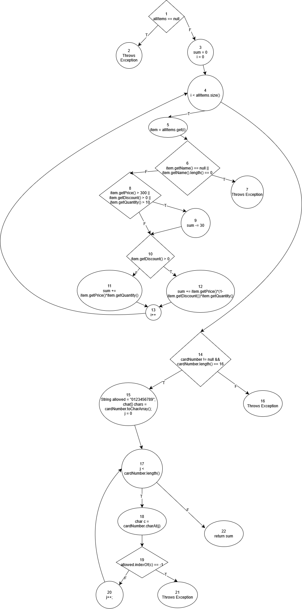

# SI_2025_lab2_235049

# Јован Парлапанов 235049

# Control Flow Graph

# Комплексност
    25 edges 22 nodes  E - N + 2P = Complexity  25-22+2=5

# Тест случаи според критериумот Every statement - 6 total
    allItems == null -> 1,2
    allItems != null,item.getName() == null -> 1,3,4,5,6,7
    allItems != null, item.getName() != null, item.getName() != 0, item.getPrice() <= 300, item.getDiscount() <= 0, item.getQuantity <= 10, cardNumber == null -> 1,3,4,5,6,8,10,11,13,14,16
    allItems != null, item.getName() != null, item.getName() != 0, item.getPrice() <= 300, item.getDiscount() <= 0, item.getQuantity <= 10, cardNumber != null, cardNumber.length() == 16, allowed.indexOf(c) == -1 -> 1,3,4,5,6,8,10,11,13,14,15,17,18,19,21
    allItems != null, item.getName() != null, item.getName() != 0, item.getPrice() <= 300, item.getDiscount() <= 0, item.getQuantity <= 10, cardNumber != null, cardNumber.length() == 16, allowed.indexOf(c) != -1 -> 1,3,4,5,6,8,10,11,13,14,15,17,18,19,20,22
    allItems != null, item.getName() != null, item.getName() != 0, item.getPrice() <= 300, item.getDiscount() > 0, item.getQuantity <= 10, cardNumber != null, cardNumber.length() == 16, allowed.indexOf(c) != -1 -> 1,3,4,5,6,9,10,12,13,14,15,17,18,19,20,22
    6 test cases

# Тест случаи според критериумот Every path
	item.getName() != null -> T || X
	item.getName().length() != 0 -> F || T
	item.getName() == null, item.getName().length() == 0 -> F || F
	item.getPrice() > 300 -> T || X || X
	item.getDiscount() > 0 -> F || T || X
	item.getQuantity() > 10 -> F || F || T
	item.getPrice() <= 300, item.getDiscount() <= 0, item.getQuantity() <=10 -> F || F || F
# Објаснување на напишаните unit tests
    Во test_Multiple_Conditions се тестира функционалноста на програмата да се справи со празен стринг "".
    Во test_Every_Statement се тестира функционалноста на програмата да се справи со cardNumber кој е еднаков на Null.